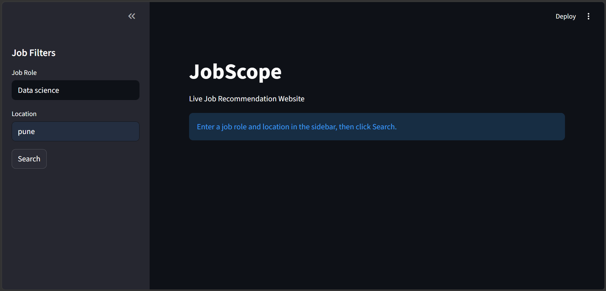
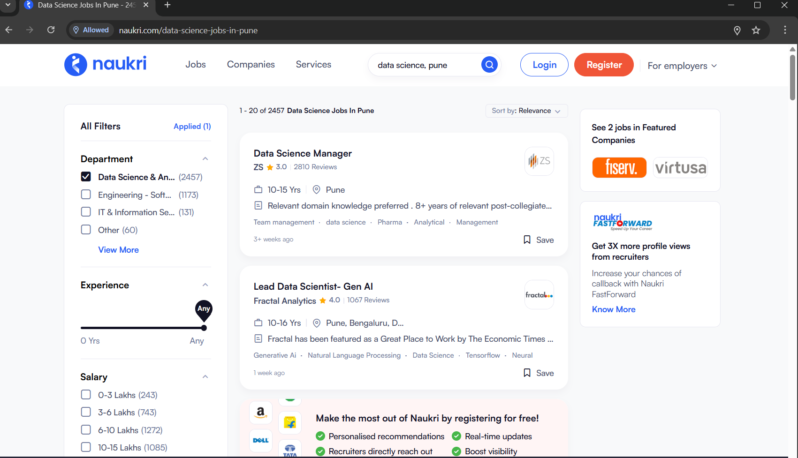
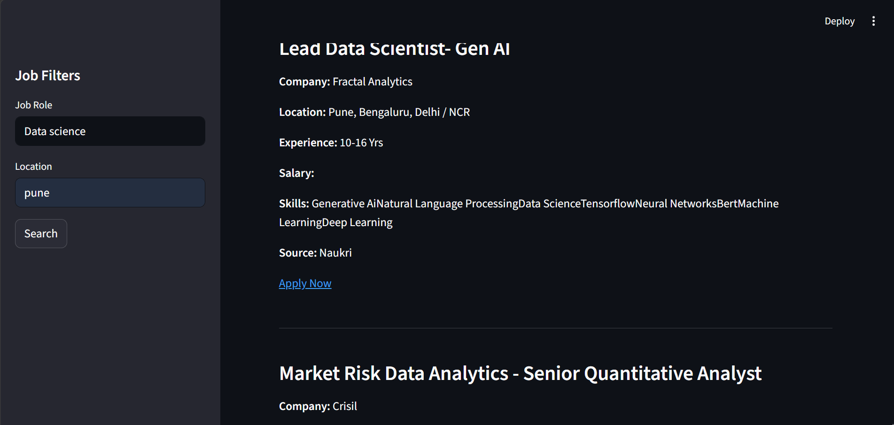

# 🚀 Multi-Source Job Scraper (JobScope)

A Python-based job search application that scrapes live job listings from multiple job portals (Naukri and Foundit). Users can search jobs by role and location, view job details.

## ✨ Features

- Live job scraping from Naukri and Foundit
- Search by Job Role
- Search by Location
- View Company, Salary, Experience and Apply Link
- Simple Streamlit UI

## 🛠️ Technologies

- Python
- Streamlit
- Playwright
- Pandas
- BeautifulSoup

## 📂 Project Structure

app.py
controller.py
scraper/
src/
data/
README.md

## 🚀 Installation

bash
git clone https://github.com/yashraj1317/Multi-Source-Job-Scraper.git

cd Multi-Source-Job-Scraper

pip install -r requirements.txt

streamlit run app.py

## 📸 Screenshots

### Home Page

### Search Page

### Results

## 👨‍💻 Author

**Yashraj Sagar Shedage**

B.Sc. Computer Science | M.Sc. Data Science

